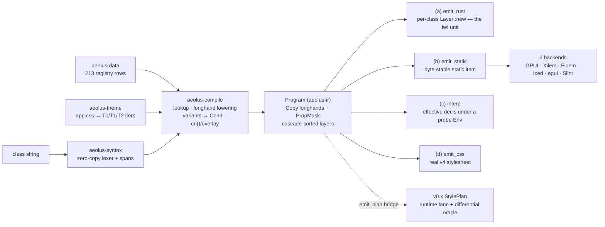

<div align="center">
  
  <p>
    <strong>Tailwind CSS v4, compiled to native UI code</strong><br/>
    Xilem · Floem · Iced · egui · Slint · <strong>GPUI</strong>
  </p>
  <p>
    Class strings in at <em>compile time</em>, frozen typed programs out — no runtime parser, no locks,
    no string matching on the hot path. Semantics verified against <code>tailwindcss</code> v4.1.17,
    the same <code>app.css</code> your web app uses, and a typed diagnostic for every class a backend
    cannot express. Nothing is ever dropped silently.
  </p>
  <p>
    <a href="https://github.com/elcoosp/aeolus/actions/workflows/ci.yml"></a>
    <a href="CHANGELOG.md"></a>
    <a href="LICENSE-MIT"></a>
    <a href=".github/workflows/ci.yml"></a>
    <a href=".github/workflows/ci.yml"></a>
  </p>
</div>

<p align="center">
  <a href="#whats-new-in-v1">What's new</a> • <a href="#quickstart">Quickstart</a> • <a href="#the-pipeline">Pipeline</a> • <a href="#backends">Backends</a> • <a href="#themes">Themes</a> • <a href="#tooling">Tooling</a> • <a href="#status--roadmap">Status</a> • <a href="#learn-more">Learn more</a>
</p>

---

## What's new in V1

The **zero-runtime pipeline is in-tree**: `tw!` no longer validates a string and hands it back —
it compiles it through the full V1 pipeline at macro-expansion time and emits a frozen
`StaticProgram`. The runtime does what hand-written code does: apply data.

|                    | v0.x runtime path                                                                 | **V1 pipeline (landed)**                                                                |
| ------------------ | --------------------------------------------------------------------------------- | --------------------------------------------------------------------------------------- |
| `tw!("p-4 …")`     | validated, then the **input string emitted back** — re-parsed every process start | compiled at expansion → **frozen static program**; the string is never emitted          |
| Static hot path    | parse → resolve → cache (**exclusive lock even on a hit**)                        | **zero parse, zero hash, zero locks** — static data applied under a `Copy` `Env`        |
| IR                 | heap-shaped `StylePlan` (`Vec`/`BTreeMap`/`Box`), per-edge set-mask patches       | `Copy` longhands (**146 props**) + `PropMask` bitsets — `p-4 ⊕ px-8` is bit ops         |
| Theme lookups      | `HashMap<String, Token>` by name                                                  | **tiered tables**: T0 literals · T1 dark pairs · T2 one load + one multiply             |
| `cn()` / overrides | string-level tw_merge at runtime                                                  | **IR-level `cn()` + `overlay`** — rightmost-wins per longhand, computed at compile time |
| Utility semantics  | 4,000-line `match` walls                                                          | **213 registry rows as data** → generated index, docs, sort order, conformance         |
| Backends           | re-lower plans on every call                                                      | all six consume the frozen program; GPUI gets macros, `Env` plumbing and polyfills      |
| Dynamic strings    | one big runtime matcher                                                           | same compiler behind `DynCache` + `ClassCell` — **no capability split**                 |

> [!IMPORTANT]
> **The honesty contract carried over.** Every class that does not lower produces a spanned, coded,
> helped diagnostic — in the macro, the CLI, and every backend walk. GPUI capability is a
> published [conformance score](docs/CONFORMANCE.md) computed from the emitter's own gates, never a
> parallel claim.

## Quickstart

Rust **1.88** for the compiler set, CLI and the GPUI lane; the five framework backends and
`aeolus-shadcn` build on **1.96** (their pinned frameworks' own requirement).
Crates are consumed from git (see [Status](#status--roadmap)):

```toml
[dependencies]
# Static / macro path (flagship):
aeolus-gpui = { git = "https://github.com/elcoosp/aeolus" }
# …or the runtime resolver path:
aeolus-core  = { git = "https://github.com/elcoosp/aeolus" }
aeolus-xilem = { git = "https://github.com/elcoosp/aeolus" }
```

### Static — compile-time (GPUI)

```rust,ignore
use aeolus_gpui::prelude::*;

// Parsed, theme-resolved and merged at expansion time.
// At runtime: static data + a Copy Env. That's it.
div().tw(tw!(
    "flex items-center gap-2 p-4 rounded-md bg-primary text-primary-foreground \
     hover:bg-primary/90 dark:shadow-none md:p-6"
))
```

Closed-world components compile to dispatch tables — shadcn's class tables keep their web vocabulary:

```rust,ignore
variants! { pub Button {
    base:    "inline-flex items-center justify-center gap-2 rounded-md text-sm font-medium",
    variant: { default: "bg-primary text-primary-foreground hover:bg-primary/90",
               destructive: "bg-destructive text-white hover:bg-destructive/90" },
    size:    { default: "h-9 px-4 py-2", sm: "h-8 px-3", lg: "h-10 px-6" },
    // cva `compound:` lists and tailwind-variants `slots:` maps supported —
    // every (slot, combo) arm compiles at expansion time.
}}
// Button::style(Variant::Default, Size::Sm) → &'static program. Zero strings at runtime.
```

### Runtime — the resolver lane (Xilem, Floem, Iced, egui, Slint)

```rust
use aeolus_core::{Resolver, shadcn_default};
use aeolus_xilem::TwViewExt;
use xilem_masonry::view::label;

let theme = shadcn_default().unwrap();       // embedded shadcn light palette
let resolver = Resolver::new(&theme);

let save = label("Save changes").tw(
    &resolver,
    "p-4 bg-primary text-primary-foreground rounded-md hover:bg-primary/90",
);
```

No build step, no browser; a CSS theme file is optional. `.tw` panics on unparseable classes in
debug and warns + drops styling in release — the honest-failure contract, not a silent no-op.
Every backend also has the V1 lane: `lower_program` walks a frozen `StaticProgram` under one probe
`Env` into its native payload, differentially pinned against the plan path.

### Dynamic strings — the explicit slow lane

```rust,ignore
// In view state: compiled when the string changes, a content compare per frame otherwise.
struct Card { classes: ClassCell }   // !Sync, UI-thread, no RwLock/Arc atomics

let program = self.classes.get(&self.user_classes, &config)?; // Result — never a panic per frame
div().tw_dyn(program)
```

`ClassCell` keys on exact content + compile identity (never hash-only), hands back the _same_
interned slices on a hit, and degrades to the last good program on a failed compile — never a
panic per frame. Behind it, `DynCache` is the bounded, content-keyed, thread-safe pool
(two-generation rotation, swappable `DynStore`). Full v4 coverage — the same compiler as `tw!`.
The observability face is the pool's own seam joined: `ClassCell::with_observer` wires a
`DynObserver` under the SAME composed `session_key` vocabulary the pool reports, so one
`CacheStats` handle spans the bounded pool AND every view cell the app wires it into. The
face answers what LEAVES too: the pool's rotation drops and stale-twin clears ride the
observer's `on_evict` under a typed `EvictReason` (the wire-up reaches the store through
the `DynStore::attach_observer` seam; the callbacks fire after the store's lock releases,
so an observer may consult the cache it watches). The walk half of the face rides beside
it: `aeolus_compile::compile_observed` reports the compile walk's OWN stage boundaries to a
`WalkObserver` (the lexer's totals, the per-candidate fold/read verdict as a typed
`CandidateOutcome`, the assembly's layer count), `WalkStats`/`WalkSnapshot` the built-in
collector — the host driving the walk itself (a build script, a server session) reads its
totals without the stringly `tracing` flag; byte-neutral by differential pin. The LSP's
wire half answers beside it: `Session::with_observer` (the loop's observed twin,
`run_stdio_observed`) streams the state machine's OWN per-message verdicts to a
`TransportObserver` — answered/quiet requests, published/exit/silent notifications, the
`TransportStats`/`TransportSnapshot` totals — the outgoing messages byte-identical to the
unwired loop's.

<details><summary><b>More usage: shadcn widgets, theme swaps, plan algebra, snapshots</b></summary>

```rust,ignore
// shadcn: real interactive widgets, your class merges last and wins via cn().
aeolus_shadcn::xilem::button(&resolver, "save", "Save",
    ButtonVariant::Default, ButtonSize::Default, "shadow-lg",
    |state: &mut AppState| state.save());
// Same tables: Floem selector maps · Iced StyleBook closures · egui WidgetVisuals · Slint states.

// Resolve without a widget:
let resolution = resolver.resolve("p-4 bg-primary hover:bg-primary/90")?;
assert!(resolution.warnings.is_empty());

// Theme swaps are explicit and version-tracked:
let mut theme = TailwindTheme::from_theme_css(custom_brand_css)?;
theme.absorb_css(dark_mode_overrides)?;   // bumps the version; drop the PlanCache

// v0.x plan algebra + portable artifacts (still the runtime lane's IR):
let merged = base.overlay(&overrides);            // later-wins per slot, diff-integrated
let json = merged.to_snapshot_json();             // canonical, byte-stable
let same = StylePlan::from_snapshot_json(&json)?; // strict reader: unknown fields are errors

// V1 IR-level composition — frozen base ⊕ runtime override:
let merged = aeolus_compile::overlay(&base, &overrides); // rightmost-wins per longhand
```

</details>

## The pipeline

One pure, deterministic function — `compile(&str, &Config)` — with a theme pass beside it.
Every stage is total and fuzzed; the same compiler serves macros, the runtime lane and the CLI.


```mermaid
flowchart LR
    A["class string"] --> S["aeolus-syntax<br/>zero-copy lexer + spans"]
    D["aeolus-data<br/>213 registry rows"] --> C
    T["aeolus-theme<br/>app.css → T0/T1/T2 tiers"] --> C
    S --> C["aeolus-compile<br/>lookup · longhand lowering<br/>variants → Cond · cn()/overlay"]
    C --> P["Program (aeolus-ir)<br/>Copy longhands + PropMask<br/>cascade-sorted layers"]
    P --> R["(a) emit_rust<br/>per-class Layer::new — the tw! unit"]
    P --> B["(b) emit_static<br/>byte-stable static item"]
    P --> I["(c) interp<br/>effective decls under a probe Env"]
    P --> X["(d) emit_css<br/>real v4 stylesheet"]
    B --> BK["6 backends<br/>GPUI · Xilem · Floem · Iced · egui · Slint"]
    P -. "emit_plan bridge" .-> SP["v0.x StylePlan<br/>runtime lane + differential oracle"]
```

| Emit arm            | Entry points                                        | What you get                                                                                               |
| ------------------- | --------------------------------------------------- | ---------------------------------------------------------------------------------------------------------- |
| **(a) Rust tokens** | `emit_rust` / `emit_rust_theme`                     | one embeddable `Layer::new` fragment per class — keyword slots resolved to row text, tokens to table names |
| **(b) Static data** | `emit_static`                                       | the program frozen into the IR's own compilable, byte-stable `static` item                                 |
| **(c) Interpreter** | `interp*` (+ `_probes` / `_containers` / `_pseudo`) | effective declarations under one probe `Env`; exclusions reported as typed notes                           |
| **(d) CSS**         | `emit_css` / `emit_css_theme`                       | v4-faithful stylesheet — verification, debugging, and `aeolus build`                                       |
| **(e) Plan bridge** | `emit_plan` / `emit_plan_theme`                     | the §7 migration seam — the artifact lowered into the v0.x `StylePlan` the backends consume                |

**Differential triangle:** new compiler ⟷ v0.x `Resolver` (kept in-tree as oracle) ⟷ real
`tailwindcss` v4.1.17 (193-entry golden corpus). Any disagreement is a bug in one of the three.
**The metamorphic checker** (`aeolus_compile::metamorphic_check*`) walks the triangle's in-tree
half per string: `interp(compile(s))` must equal the CSS emit's cascade-resolved rules for every
probe situation the string names — the diagnostics channels byte-equal, the sheet the
per-candidate parts, every documented divergence a typed note.

## Backends

Every backend consumes **both** the v0.x `StylePlan` (runtime lane) and the V1 frozen
`StaticProgram` (`lower_program`, differential-pinned, benched, with a headless example).

| Backend         | Crate          | Lowers to                                               | Highlights                                                                                                  |
| --------------- | -------------- | ------------------------------------------------------- | ----------------------------------------------------------------------------------------------------------- |
| **GPUI** ⭐     | `aeolus-gpui`  | `TwExt` / `TwStateExt` + frame `Env`, `AeolusRoot`      | macro/static flagship; `ring-*` → v4 `BoxShadow` bands; the filter chain's colour-matrix polyfill + `drop-shadow-*` bands; 2-stop linear gradients; `tw_probes` attribute bits |
| Xilem / Masonry | `aeolus-xilem` | `PropertyStack` + per-state `ResolvedStyle`             | **native gradients** (linear exact, radial normalized; conic reported)                                      |
| Floem           | `aeolus-floem` | programmatic `Style`, nested selector maps              | native transitions; full pinned-rev taffy surface (grid, overflow, dashes…)                                 |
| Iced            | `aeolus-iced`  | `StyleBook` → Catalog closures per `Status`/`&Theme`    | linear gradients native; per-corner radius; opacity baked into painted alphas                               |
| egui            | `aeolus-egui`  | `Frame` + `WidgetVisuals` state cascade                 | hover/press restyle via egui's own machinery; shadows with spread native; gradients through the shipped mesh painter (`GradientPaint`/`gradient_mesh` — linear/radial/conic, rect-clipped) |
| Slint           | `aeolus-slint` | brushes + generated `.slint` bindings & `states` blocks | every emitted binding **compiler-validated in CI**                                                          |

Per-slot support: [capability matrix](reports/02-capability-matrix/CAPABILITY_MATRIX.md) ·
V1 conformance: [docs/CONFORMANCE.md](docs/CONFORMANCE.md) (generated from the emit gates, drift-gated).

## Themes

**The same `app.css` a web Tailwind v4 project uses works unchanged** — that's a headline feature.

The theme stage is observable now: `TokenTable::with_observer` wires a `ThemeObserver` and every
`resolve`/`resolve_rgba` verdict streams typed — the tier arm that answered or the verbatim refusal —
with the built-in `ThemeStats` collector the shared handle (`TokenTable::with_observer`, the
`DynObserver`/`WalkObserver` faces' house shape landed in the theme pass).

```css
/* app.css */
@theme { --color-primary: oklch(0.55 0.2 250); }
.dark  { --color-primary: oklch(0.70 0.15 250); }
```

Pay only for the dynamism you use:

| Tier              | When                                   | Emitted                | Runtime cost                      |
| ----------------- | -------------------------------------- | ---------------------- | --------------------------------- |
| **T0** static     | theme known at compile time (`theme!`) | colour literals        | **0**                             |
| **T1** light/dark | same, with a `.dark` block             | `[Rgba; 2]` const pair | 1 branch-free index by `Env.dark` |
| **T2** runtime    | user-editable themes, live bridges     | `Tok { id, alpha }`    | 1 table load + 1 multiply         |

- **`/opacity` is one multiply, not colour maths.** v4's `color-mix(… transparent)` in premultiplied
  space only scales alpha: `bg-primary/90` → `(L, a, b, α·0.9)`. Baked to a literal when static;
  property-tested against the real compiler.
- `calc()` + `--spacing` folded at build time; oklch → sRGB gamut-mapped **once**.
- `theme!` emits an `include_str!` pin, so editing the CSS triggers a Cargo rebuild.
- **CSS-first authoring, all four forms:** `@theme`, `@utility` (incl. functional `--value()`),
  `@custom-variant`, `@source` (inline literals, walked paths, pruned paths — feeds `check`/`build`).
  The `@custom-variant`/`@utility` statements register onto the same typed `Customs` surface
  (`customs_from_css`): `@apply` composite bodies compile at registration — the multi-decl
  `CustomValue::Applied` form, the body's keyword texts riding beside the decls — and the functional
  star bodies (`--value(integer|number|percentage|color)`, `--spacing(n)`) ride the same
  `CustomForm` grammar the typed API takes; every malformed statement, refused selector and
  outside-the-grammar value is a typed `CustomCssError`.

## Variants & state

`Env` is a `Copy` struct of frame facts written once per frame (`AeolusRoot`) — one TLS read, no locks.

| Family                                                     | V1 mapping                                                            | Status                                                        |
| ---------------------------------------------------------- | --------------------------------------------------------------------- | ------------------------------------------------------------- |
| `hover:` `active:` `focus:` `focus-visible:`               | native state refinements (GPUI) / selector maps / status closures     | ✅                                                            |
| `group-*` / `peer-*` (incl. named, `*-has-*`)              | parent-tier typed `Cond`s                                             | ✅                                                            |
| `dark:`                                                    | T1 pair index / `Env.dark`                                            | ✅ branch-free                                                |
| `sm:` … `2xl:` (and the `max-*:` complements)              | `Env.viewport_rem` compare, CLI `expand --width`                      | ✅ 1 compare                                                  |
| `data-*:` `aria-*:`                                        | typed `AttrProbe` bits (`tw_probes`), CLI `expand --data/--aria`, CSS selector semantics | ✅                                                            |
| `has-*:` `group-has-*:` `peer-has-*:`                      | typed `Cond::Has` + `DescendantProbe` subtree facts (`tw`-side `*_descendants` walks), CSS `:has()` semantics | ✅                                                            |
| `supports-*:` `supports-[…]:`                              | typed `Cond::Supports` + `SupportsProbe` capability facts (`tw`-side `*_supports` walks), CSS `@supports` semantics | ✅                                                            |
| `motion-*:` `contrast-*:` `forced-colors:` `print:` `inverted-colors:` `noscript:` | typed `Cond::Media` bits, `Env` preference facts (frame state — no probe seam), CSS media-query semantics | ✅                                                            |
| `pointer-*:` `any-pointer-*:` `portrait:` `landscape:`     | typed `Cond::Media` bits, `Env` capability facts (the same frame-state tier; `landscape:` the `portrait:` complement), CSS media-query semantics | ✅                                                            |
| `ltr:` `rtl:`                                              | typed `Cond::Dir` bit, one `Env` direction fact (`ltr:` the `rtl:` complement), CSS `:where(:dir(…))` selector semantics | ✅                                                            |
| `valid:` `invalid:` `user-valid:` `user-invalid:`          | typed `Cond` states, two `Env` facts (the constraint pair + the `user-` interaction gate), CSS `:pseudo` selector semantics | ✅                                                            |
| `target:` `indeterminate:` `autofill:` `read-only:`        | typed `Cond` states, one `Env` fact each (`read-only:` the editability fact's complement — the resting env answers), CSS `:pseudo` selector semantics | ✅                                                            |
| `open:` `inert:` `default:`                                | typed `Cond` states, one affirmative `Env` fact each (the v0.x `State` surface's own slots — the v0.x-gap closure the element-state landing documented), CSS `:is([open], :popover-open, :open)`/`:is([inert], [inert] *)`/`:default` selector semantics | ✅                                                            |
| `enabled:` `required:` `optional:` `in-range:` `out-of-range:` | typed `Cond` states, the two-fact answers (the membership fact `form_associated`/`range_bounded` beside the pair's shared state bit `required_field`/`range_in` — the matches-neither boundary evidence 27 documented closes), CSS `:pseudo` selector semantics | ✅                                                            |
| `@md/card:` named containers                               | typed `Cond` + `ContainerProbe` bounds seam, CLI `expand --container` | ✅ (`tw_container` measures; the walk consumes)               |
| `selection:` `placeholder:` `before:` `after:` `marker:` `first-letter:` `first-line:` `file:` `backdrop:` `details-content:` | the `PseudoTarget` render-target tier (10 targets, the closed set): the element walks exclude, `interp_pseudo` resolves the target's own cascade (`program_style_pseudo` the frozen program's), the CSS arm renders the upstream heads (`marker:` the four-selector disjunction; `before:`/`after:` the injected `content: var(--tw-content)` line), CLI `expand --pseudo`, `file:` lands the v0.x plan, the rest the typed `PlanNoteKind::PseudoElement` boundary | ✅                                                            |
| `first:` `last:` `odd:` `even:` `only:` `empty:` `nth-N:` `nth-last-N:` | the structural family (`StructProbe`/`StructFacts`): `first-of-type:` `last-of-type:` `only-of-type:` `nth-of-type-N:` `nth-last-of-type-N:` the OF-TYPE tier beside them (the type-relative facts ride the same seam — what "same type" means is the host own reading, never a tag string), the CSS arm renders `:first-child` through `:nth-last-of-type(N)`, the plan bridge lands the oracle own `Test::Structural` table, CLI `expand --child/--child-of-type/--empty` | ✅ |
| `starting:` | the `@starting-style` at-rule (the transition first frame — the at-rule tier beside the media features): ONE affirmative `Env::starting_style` frame fact (the host first-render gate), the unset bit the quiet miss, the CSS arm renders the bare `@starting-style` head, the plan bridge reports the typed `PlanNoteKind::StartingStyle` boundary, CLI `expand --starting` | ✅ |
| `transition-*` `duration-*` `ease-*` `delay-*` `animate-*` | five motion longhands, v4 default-theme texts                         | ✅ pipeline (GPUI `with_animation` needs id+state — reported) |
| arbitrary selectors, unsupported forms                     | precise per-form reason + suggested alternative                       | 🛑 diagnosed, never silent                                    |

## Tooling

```sh
aeolus check src/ --theme app.css --fail-on unknown   # lint class strings in CI (@source-aware)
aeolus sort "block p-4 mx-2 hover:block"              # canonical registry order
aeolus fmt src/widget.rs                              # one file's class strings into the canonical order (--check = the CI drift gate)
aeolus explain "p-4 flex-col" --theme shadcn          # class → the Rust tokens it emits
aeolus expand "hidden dark:block" --dark              # effective declarations under a probe Env
aeolus expand --pseudo before "before:p-8"            # the pseudo-element render target's own cascade
aeolus expand --has element=*:focus "has-focus:p-8"   # the subtree facts the has-* layers answer from
aeolus expand "data-[state=open]:flex" --data state=open  # the attribute bits the data-*/aria-* layers answer from
aeolus build src/ --theme shadcn-dark --out app.css   # whole project → ONE stylesheet
aeolus plan "p-4 hover:px-8" --theme shadcn | jq .    # the V1 lane's plan bridge → the same snapshot JSON
aeolus audit src/ --fail-on refused                   # per-class capability audit vs GPUI (tiers + boundary reasons)
aeolus resolve "p-4 bg-primary" | jq .                # plan snapshot · css · diff · cn also available
```

| Tool                                       | What it does                                                                                                                                                                          |
| ------------------------------------------ | ------------------------------------------------------------------------------------------------------------------------------------------------------------------------------------- |
| `aeolus build`                             | scan → global dedupe → registry-ordered rules + self-contained `:root`/`.dark` vars block; diagnostics at **every** occurrence                                                        |
| `aeolus plan`                              | the V1 lane's plan bridge (`Target::Plan`): the v0.x `StylePlan` the backends consume, as the same canonical snapshot JSON `resolve` prints; slot-boundary notes + per-class misses ride stderr, `--fail-on` keys on the typed codes                        |
| `aeolus check`                             | unknown classes with suggestions, unsupported utilities with reasons, `cn()` conflicts with winner attribution; `--fail-on` exit codes                                                |
| `aeolus fmt`                               | the class-sort seam's file face: one file's class strings into the canonical order (`sort`'s batch form — stdout rewrite, the file untouched); `--check` prints `path:line:col "before" -> "after"` per out-of-order string and exits 1 — the CI drift gate |
| `aeolus audit`                             | the capability audit (§5.1's project-sized twin): every scanned class string's longhands tiered against the GPUI backend ([`Caps`](crates/aeolus-codegen-gpui/src/lib.rs), the generated table the emit gates run), the refused/polyfill rows naming the capability's own typed boundary reason, the observed-set score in the summary; `--fail-on refused\|polyfill\|any\|none` turns the report into the CI gate (report-only by default), `--json` the machine form |
| `cargo xtask gen-tables` / `verify-tables` | regenerate & drift-gate the committed artifacts: roots index, [docs/REGISTRY.md](docs/REGISTRY.md), [docs/CONFORMANCE.md](docs/CONFORMANCE.md), the GPUI capability table — a stale row fails plain `cargo test` |
| `aeolus-lsp` (the LSP server)              | editor hover, diagnostics, completion and colour swatches over the same pipeline: `hover` per class (longhand signature or typed refusal with its code), the extraction seam's strings linted per location, `completion` at the typing edge (registry spellings, theme tokens, the closed variant set — the compiler's own audited tables), `documentColor` swatches (the table's resolved light-tier rgba), `documentDiagnostic` pull (LSP 3.17 — the SAME findings the push channel publishes, recomputed on demand), `semanticTokens` (LSP 3.16 — every candidate's compile outcome onto the legend: lowered `class`, refused the custom `refused` type), `colorPresentation` (the picker's spellings — the table walked backwards, every root/token/opacity-step that re-resolves to the picked colour), `inlayHint` (LSP 3.17 — every lowered class rides one hint at its end: the CSS arm's own declarations compacted, the hover's markdown as the tooltip; a refused class never hints), `codeAction` quick fixes (the "did you mean" seam — every correction a spelling the pipeline lowers, the variant prefix and `/modifier` tail composed back on), `documentHighlight` (the cursor's class, every occurrence in the file), `rename` (the rename face — `prepareRename`'s candidate span under the cursor, `rename`'s one edit per textual occurrence of that candidate over EVERY open document — the references' own fold over the rename edits, each edit riding its document's URI, URI order across the map, the highlights' own raw-text equality), `formatting` (the class-sort seam's editor face — one edit per out-of-order class string, the canonical order as the new text, an already-canonical string answering nothing: the format-on-save no-op) and `documentSymbol` (the outline face — one symbol per candidate class in document order, the semantic legend's verdict beside the pipeline's own detail line: the compact CSS the class lowers to, or the refusal's stable code), `references` (the first cross-document answer — the highlights' textual equality over EVERY open document, each occurrence riding its `Location`, URI order across the map, a refused class's occurrences answering exactly like a lowered one's) and `workspace/symbol` (the workspace outline — the documentSymbol contract over every open document, the query the case-insensitive substring filter, the empty query riding every open candidate), `selectionRange` (the expand-selection walk — one parent chain per requested position, the candidate span the shared locator keys with the string's content span riding as its parent, the caret's zero-width range the chain-less answer outside any string), `linkedEditingRange` (the simultaneous-edit face — the highlights' textual equality as the client's edit-together ranges, same-file only: the cross-document fold stays the rename face's) and the theme lifecycle (the watched-files event naming the wired `ThemeLoader`'s URI re-themes the running session — the equal-content save the byte-neutral no-op, the swap retiring the pool it invalidates and republishing every open document; `Session::with_theme_loader` the face, `run_stdio_with_theme` the loop, the binary's `--theme <path>` the consumer flag); the session's compiles ride the bounded `DynCache` pool — the keystroke repeat is the cheap path, the pool face on `AeolusEngine::with_observer`, the walk face on `AeolusEngine::with_walk_observer`; the wire half answers beside them — `Session::with_observer` (the loop's observed twin `run_stdio_observed`) streams the state machine's per-message verdicts (`TransportObserver`: answered/quiet requests, published/exit/silent notifications, `TransportStats` totals, the answers byte-identical); the outline folding face beside the documentSymbol outline (`textDocument/foldingRange` — one fold per extracted class string, the string's own content span, document order, no compile verdict riding, the multi-line raw-string call sites the folds the editor actually collapses) and the workspace-wide pull (`workspace/diagnostic` — every open document's report beside its content-keyed result identity, the unchanged verdict the client's cache answers from, nothing recomputes); `bin/aeolus-lsp` speaks stdio JSON-RPC |

## Correctness & performance

- **Spec-first:** registry + IR published as data; golden corpus generated by the real v4.1.17
  compiler (193 entries, growing by mining Tailwind's own test cases).
- **Differential pins everywhere:** lexer ⟷ v0.x parser, `cn()` ⟷ tw_merge oracle, plan bridge ⟷
  v0.x resolver, index ⟷ linear scan, `ClassCell` ⟷ macro-frozen program (byte-equal).
- **Fuzz + property suites:** seven fuzz targets (60 s CI sweeps — the §5.3 metamorphic
  `compile ⇒ interpret == emit` target rides the V1 pipeline since 2026-11), `/opacity`
  identity property test, the deterministic metamorphic battery (`tests/metamorphic.rs`).
- **Allocation contract:** counting-allocator tests pin the hot path (`diff` of equal plans:
  **zero** allocations). Workspace battery: 2235 tests with all features enabled (2026-11,
  the folding-face handoff's honest sum — `cargo test --workspace --all-features`; the
  folding face's and the workspace pull's two batteries beside the standing pins).

| Metric                                 | v0.x — *measured*¹          | V1 — *target*²                                       |
| -------------------------------------- | --------------------------- | ---------------------------------------------------- |
| Static class application               | ~405 ns warm + lowering     | hand-written-builder parity (±2 % instruction count) |
| Locks / allocs on the static path      | ≥1 exclusive lock, ≥1 alloc | **0 / 0** (+ GPUI's own boxing)                      |
| Cold dynamic resolve (33-class button) | 4.6 µs                      | ≤ 1.5 µs                                             |
| Warm dynamic (`ClassCell` hit)         | ~405 ns                     | ≤ 20 ns                                              |

¹ divan, release profile, Linux CI — method & caveats in [BENCHMARKS.md](reports/08-benchmarks/BENCHMARKS.md).
² Contract from the [V1 plan §4](docs/AEOLUS_V1_ARCHITECTURE.md); the P0 divan
gates replace targets with measured numbers before 1.0 (the `iai-callgrind`
instruction-count golden stays the flagged nightly half). Structural guarantees
(no parse/hash/locks on the
static path) hold by construction today.

## Feature flags

Every flag is additive and off by default — the documented defaults are
the zero-dependency builds; the workspace battery pins the all-features
build (`cargo test --workspace --all-features`), CI's suite the
defaults (there is no conflict-feature bundle to gate — every flag
composes):

| Flag | Crates | What it adds |
| --- | --- | --- |
| `tracing` | `aeolus-cli`, `aeolus-compile`, `aeolus-data`, `aeolus-theme` | `debug_span!`/`debug!` events on the pipeline walk (compile, interp, sort, expand); no subscriber is installed — the host owns that. The flags FORWARD down the pipeline (`aeolus-cli` → `aeolus-compile`/`aeolus-theme` → `aeolus-data`), so one flag instruments the whole walk from any layer |
| `miette` | `aeolus-cli`, `aeolus-compile`, `aeolus-data`, `aeolus-theme` | structured [`miette::Diagnostic`] impls on the typed errors/diagnostics (codes, help text, spans); forwards down the pipeline with `tracing` |
| `verbose-diagnostics` | `aeolus-macro` | multi-line compile-error rendering for `tw!`/`cn!` refusals (the single-line form stays the default) |

## Status & roadmap

**v0.19.0** (2026-11). `aeolus-core` is publish-ready (`cargo package` is a CI gate); the V1 crates,
backends, macros, runtime, CLI and xtask are **git-only** (`publish = false`) while the pipeline
settles toward 1.0. The v0.x `Resolver`/`StylePlan` stay in-tree as the runtime lane **and** the
differential oracle — no big-bang migration.

| Phase                   | Scope                                                                                                                                             | Status                         |
| ----------------------- | ------------------------------------------------------------------------------------------------------------------------------------------------- | ------------------------------ |
| **P0** Prove it         | iai/criterion gates vs hand-written builders; replace §4 targets                                                                                  | ✅ the stable half landed 2026-11 — `benches/perf_contract` (the walk beside the hand-written chains, parity-pinned; walk 1.07 µs vs hand 84 ns on the button string, clone 70 ns, cell warm 908 ns) — the iai-callgrind instruction-count golden stays nightly |
| **P1** Data-driven core | `aeolus-syntax` · `aeolus-data` (213 rows) · `aeolus-ir` (146 longhands)                                                                          | ✅ landed                      |
| **P2** Full pipeline    | compile + theme passes, IR `cn()`, **all five emit arms**, customs, `DynCache`, arbitrary values, attribute fold, xtask generator                 | ✅ landed                      |
| **P3** GPUI static      | `aeolus-codegen(-gpui)`, reworked `aeolus-macro`, `aeolus-rt`, `aeolus-gpui`; `ClassCell` dynamic lane; ring polyfill; shadow tier (`shadow-*` → GPUI's own `Vec<BoxShadow>`) | ✅ landed                      |
| **P4** Env & state      | frame `Env`, dark/breakpoints, state layers, `AttrProbe` host seam                                                                                | ✅ landed                      |
| **P5** Ecosystem        | gpui-rsx integration PR (`lower_class` seam ready), **LSP landed 2026-11** (`aeolus-lsp`: hover, diagnostics, completion and colour swatches over the same pipeline), gpui-component bridge, docs book, public benchmarks, **1.0-rc** | 🔜 next — the LSP row is in |
| **P6** Breadth          | 5-backend re-target ✅ · ring + gradient lanes ✅ · motion pipeline ✅ · named containers + bounds seam + measuring wrapper ✅ · pseudo targets ✅ · project build ✅ | ✅ mostly — see boundaries     |

**Open boundaries — typed, test-pinned, never silent:**

- composite arbitrary values landed (the IR's verbatim slot: `calc()`, track lists, `url()`, `aspect-[16/9]`) and the wider v4 hint table landed (`angle:` on the degree rows, `time:` on the millisecond rows, `position:`, `family-name:`/`generic-name:`, `absolute-size:`/`relative-size:`, `string:` onto the new `content` longhand — the `content-["…"]` spelling now lowers); the arbitrary-property form (`[mask-type:luminance]`) → the remaining typed refusal
- the `has-*` family answers through the descendant-probe seam (`DescendantProbe`/`DescendantState`, the `*_descendants` walks); the `*:` arbitrary-variant half stays diagnosed with reasons (honest failure, kept)
- container **measurement** (who computes element widths) → the seam landed, the GPUI walk answers named queries through it (`tw_containers`), and the GPUI measuring wrapper landed beside it: `tw_container(name, &MeasuredContainers)` publishes the element box's width at the layout phase, the delta handshake asks for one re-render on a real change
- GPUI motion's static emit keeps its per-longhand refusals (`with_animation` needs element id + animator — the stateful `TwAnimExt` lane applies them at runtime); >2-stop / radial / conic gradients refuse
- the decoration family landed (`decoration-{color,thickness,style}` — three appended longhands, the GPUI walk riding the pinned `text_decoration_*` methods); GPUI renders a single solid line, so the `double`/`dotted`/`dashed` style keywords and the `auto`/`from-font`/rem/percent thickness forms keep their typed refusals (the CSS/interp arms carry the real output)
- the shadow tier's `shadow-inner` placeholder keeps its typed note on the plan bridge (the `currentColor` has no plan answer); GPUI composes it (the pinned `BoxShadow` carries the `inset` flag), and the plan presets/`shadow-none`/`shadow-{color}` map through the oracle's own pass order (a preset beats the recolour, the oracle's own observable semantics)
- per-backend gradient gaps: **egui's gap closed 2026-11 — the mesh-painter seam** (`GradientPaint` + `gradient_mesh`: the lowering bakes the payload, the backend ships the painter egui's solid-`Color32` `Frame` lacks; linear exact through banded strips, radial concentric rings over the `farthest-corner` radius, conic angular sectors — all clipped to the rect, the CSS `background-image`-over-`background-color` layering rendered). Still typed refusals upstream-blocked: conic on Masonry (the vello sweep TODO), radial/conic on Iced (the `Gradient` brush is linear-only at 0.14), Floem (no gradient brush — `Brush::Gradient` needs concrete geometry) → capability matrix

## Crate map

**Compiler** (zero-dep core discipline; MSRV 1.88)

| Crate            | Role                                                                                                                   |
| ---------------- | ---------------------------------------------------------------------------------------------------------------------- |
| `aeolus-syntax`  | zero-copy lexer: borrowed candidates + spans (std build today; `no_std + alloc` capable per the architecture plan)      |
| `aeolus-data`    | the registry as data: 213 audited rows → generated roots index, docs, sort order                                       |
| `aeolus-ir`      | `Copy` longhand IR: `Prop`/`Val`/`Decl`/`Layer`/`Program` + `PropMask` bitset algebra                                  |
| `aeolus-theme`   | CSS-first `ThemeSource` → tiered `TokenTable`s; `@source` directives                                                   |
| `aeolus-compile` | the pipeline: `compile`/`cn`/`overlay`, 5 emit arms, `Customs`, `DynCache`, `sort`, `scan`/`build`, `emit_plan` bridge, the `WalkObserver`/`compile_observed` walk face |

**Emit & runtime**

| Crate                 | Role                                                                                                                        |
| --------------------- | --------------------------------------------------------------------------------------------------------------------------- |
| `aeolus-codegen`      | backend-neutral `Emit` trait + `Capability`/`Conformance` report                                                            |
| `aeolus-codegen-gpui` | GPUI token emitter, native + polyfill capability tiers, `lower_class` third-party seam                                      |
| `aeolus-macro`        | `tw!` / `cn!` / `tw_cn!` / `variants!` (compound + slots) / `theme!` — syn-free; emits the frozen program, never the string |
| `aeolus-rt`           | host seam: `StaticProgram` (the `style*` and probe faces beside the free walks), `Env`, `TokenTable`, `DynCache` + the `DynObserver`/`CacheStats`/`EvictReason`/`session_key` observability face the cell joins (the `WalkObserver` walk face re-exported beside), `ClassCell`, `MeasuredContainers`, `theme_from_css`                             |

**Integration & tooling**

| Crate                               | Role                                                                                            |
| ----------------------------------- | ----------------------------------------------------------------------------------------------- |
| `aeolus-gpui` + five backend crates | see [Backends](#backends) — plan lane + V1 static-program lane each                             |
| `aeolus-shadcn`                     | shadcn `new-york-v4` class tables verbatim + per-backend wrappers + the closed-world program tables (`ButtonPrograms`, the F6 fix) |
| `aeolus-cli`                        | `resolve` `css` `diff` `cn` `check` `explain` `sort` `fmt` `expand` `build` `plan` `audit` — zero external crates    |
| `aeolus-lsp`                        | the P5 LSP row: headless engine (extraction seam → V1 compile walk → UTF-16 ranges, hover signatures, completion from the audited tables, colour swatches, `documentDiagnostic` pull, the rename face — `prepareRename`'s span, `rename`'s per-occurrence edits, the `documentSymbol` outline; the cross-document answers — `references` (the highlights' equality over every open document), `workspace/symbol` (the outline over the whole map, the query the filter) and the cross-document `rename` (the references' fold over the rename edits, one edit per occurrence over every open document, the full `changes` map at the wire); the expand-selection walk (`textDocument/selectionRange` — one parent chain per position, the content span the chain's head, the caret's zero-width range the chain-less answer) and the linked-editing face (`textDocument/linkedEditingRange` — the highlights' textual equality as the client's edit-together ranges, same-file)); the theme lifecycle rides beside them (the watched-files event naming the wired `ThemeLoader`'s URI re-themes the session, `Session::with_theme_loader` the face, `run_stdio_with_theme` the themed loop); the outline folding face and the workspace-wide pull beside them (`textDocument/foldingRange` — one fold per class string, the multi-line raw-string form the real fold; `workspace/diagnostic` — the pull over every open document beside its result identity, a matching previous id the unchanged verdict the client's cache answers from); the token goto-definition face (`textDocument/definition` — the cursor's token class answers the theme file's own `--color-{name}`/`--{name}` declaration, the theme pass's provenance scan byte-true (comments, quoted strings and `var()` references are not declarations; a seeded token the file never declares answers no origin) under the config's named origin URI, `TokenOrigins` the host store that rides first) and the server's command surface (`workspace/executeCommand` — `aeolus.sortDocument`, the sort face as a command, the closed table advertised, an unknown command the protocol's null); the session's compiles ride the bounded `DynCache` pool, `with_observer` the face) + stdio JSON-RPC state machine (`bin/aeolus-lsp`) + the transport face (`TransportObserver`/`TransportStats` on `Session::with_observer`, `run_stdio_observed` the observed loop) |
| `xtask`                             | `gen-tables` / `verify-tables` drift gates for the committed artifacts (+ the §3.7 `gen-gpui-caps` / `verify-gpui-caps` pair)                          |
| `aeolus-core`                       | v0.x `Resolver` + `StylePlan`: the runtime lane and the differential oracle — **publish-ready** |

_`crates/muda-stub` is a dev-sandbox patch crate — never a dependency of a publishable crate._

## Examples

The fastest way in — every crate ships runnable, headless examples (the generator driver included: its library face is the same `run(args, out, err)` shape the CLI's):

```sh
cargo run -p aeolus-compile --example compile_pipeline  # lex → registry → longhand Program + diagnostics
cargo run -p aeolus-compile --example theme_seam        # tiers + the /opacity identity
cargo run -p aeolus-compile --example project_build     # scan → dedupe → whole-project stylesheet
cargo run -p aeolus-rt --example class_cell             # the dynamic lane: hit/miss counters, honest degradation
cargo run -p aeolus-compile --example dyn_store         # the DynStore storage seam: a host's own bounded store
cargo run -p aeolus-compile --example walk_observer     # the walk face: the stage events, the byte-neutral twin
cargo run -p aeolus-theme --example theme_observer      # the theme-resolution face: tier arms + typed misses streamed
cargo run -p aeolus-core --example gamut                # the CSS Color 4 gamut mapping: clamp beside chroma reduction
cargo run -p aeolus-gpui --example ring                 # ring-* → v4 BoxShadow bands
cargo run -p aeolus-gpui --example shadow               # shadow-* → GPUI's own BoxShadow list (the native tier)
cargo run -p aeolus-gpui --example filters               # the filter chain's colour-matrix polyfill + drop-shadow bands
cargo run -p aeolus-gpui --example decoration            # the decoration tier: colour/thickness/style on GPUI's own methods
cargo run -p aeolus-compile --example filters           # the pipeline's filter layer: the v4 var-chain forms
cargo run -p aeolus-compile --example backdrop_filters  # the backdrop layer: both properties, -webkit- beside the standard
cargo run -p aeolus-compile --example grid_flow         # the grid-flow family: the auto-flow slot end to end
cargo run -p aeolus-compile --example hints             # the wider v4 hint table: angle/time/position/family/string end to end
cargo run -p aeolus-compile --example shadow_plan       # the plan bridge's shadow slot: presets + recolour, differential
cargo run -p aeolus-gpui --example containers           # named @container queries through the bounds seam
cargo run -p aeolus-gpui --example container_query      # the measuring wrapper: publish → walk → resize beat
cargo run -p aeolus-gpui --example struct               # first:/last:/odd: through the DOM-position seam
cargo run -p aeolus-gpui --example motion               # the animation lane: frozen shorthand → gpui::Animation
cargo run -p aeolus-gpui --example placement            # grid placement + flex-basis on GPUI's own slots
cargo run -p aeolus-shadcn --example program_tables     # the closed-world program tables (the F6 fix)
cargo run -p aeolus-codegen-gpui --example conformance  # the published score, from the emit gates themselves
cargo run -p aeolus-compile --example metamorphic       # compile ⇒ interpret ⇒ equals emit: the per-situation agreement report
cargo run -p aeolus-lsp --example lsp_hover             # the LSP engine headless: diagnostics + hover renderings
cargo run -p aeolus-lsp --example lsp_cache             # the engine's pool ride: keystroke repeats hit, one stats handle
cargo run -p aeolus-lsp --example lsp_walk_observer     # the walk face over the pooled path: misses stream, hits stay silent
cargo run -p aeolus-lsp --example lsp_transport_observer  # the transport face: the loop's per-message verdicts, the byte-neutral twin
cargo run -p aeolus-lsp --example lsp_completion        # the completion answer: variants, keywords, tokens
cargo run -p aeolus-lsp --example lsp_colours           # the colour swatches: the table's resolved rgba
cargo run -p aeolus-lsp --example lsp_diagnostics       # the documentDiagnostic pull (the push channel's findings, pulled)
cargo run -p aeolus-lsp --example lsp_semantic_tokens   # the semantic tokens: the legend, the decoded highlights
cargo run -p aeolus-lsp --example lsp_colour_presentations  # the picker's spellings: the table walked backwards
cargo run -p aeolus-lsp --example lsp_inlay_hints       # the inline hints: the class's CSS at its end
cargo run -p aeolus-lsp --example lsp_code_actions      # the quick fixes + the click-to-find highlights
cargo run -p aeolus-lsp --example lsp_document_highlights  # the click-to-find highlights: every occurrence whose text equals the cursor's
cargo run -p aeolus-lsp --example lsp_format            # the canonical-order formatting: one edit per out-of-order string
cargo run -p aeolus-lsp --example lsp_rename            # the rename face: prepareRename's span, one edit per occurrence
cargo run -p aeolus-lsp --example lsp_references        # the cross-document references: the highlights' equality over the whole map
cargo run -p aeolus-lsp --example lsp_workspace_symbols # the workspace outline: the query the filter over every open document
cargo run -p aeolus-lsp --example lsp_workspace_rename  # the cross-document rename: the references' fold over the rename edits
cargo run -p aeolus-lsp --example lsp_selection_ranges  # the expand-selection walk: one parent chain per cursor
cargo run -p aeolus-lsp --example lsp_theme_reload  # the theme lifecycle: the watched-files event re-themes the session
cargo run -p aeolus-lsp --example lsp_linked_ranges  # the linked-editing face: the edit-together ranges per cursor
cargo run -p aeolus-lsp --example lsp_folding_ranges  # the folding face: one fold per class string, the raw-string form the real fold
cargo run -p aeolus-lsp --example lsp_workspace_diagnostics  # the workspace pull: the result identity, the unchanged verdict beside the recompute
cargo run -p aeolus-lsp --example lsp_definition  # the goto-definition face: the token class's declaration in the theme file
cargo run -p aeolus-lsp --example lsp_execute_command  # the command surface: aeolus.sortDocument as a command, the closed table's nulls
cargo run -p aeolus-cli --example expand_viewport       # expand --width: the viewport fact the sm:..2xl: layers answer from
cargo run -p aeolus-lsp --example lsp_symbols           # the outline face: one symbol per candidate class, the verdict beside the name
cargo run -p aeolus-cli --example fmt                   # the fmt command's file face: the drift report + the rewrite
cargo run -p aeolus-compile --example descendants       # the descendant-probe seam: the has-* family answers
cargo run -p aeolus-cli --example expand_descendants    # expand --has: the subtree facts the has-* layers answer from
cargo run -p aeolus-compile --example supports          # the supports seam: the @supports family answers
cargo run -p aeolus-cli --example expand_supports       # expand --supports: the capability facts the supports layers answer from
cargo run -p aeolus-compile --example preferences       # the preference families: the media-feature tier answers
cargo run -p aeolus-cli --example expand_preferences    # expand --reduced-motion/--more-contrast/--forced-colors/--print/--inverted-colors/--noscript: the facts the preference layers answer from
cargo run -p aeolus-compile --example capabilities      # the capability tier: pointer/orientation media-feature answers
cargo run -p aeolus-cli --example expand_capabilities   # expand --pointer-fine/--portrait: the facts the capability layers answer from
cargo run -p aeolus-compile --example direction         # the direction family: ltr/rtl selector-side answers
cargo run -p aeolus-cli --example expand_direction      # expand --rtl: the direction fact the rtl/ltr layers answer from
cargo run -p aeolus-compile --example validation        # the validation states: valid/invalid/user-* element-state answers
cargo run -p aeolus-cli --example expand_validation     # expand --invalid/--user-*: the facts the validation layers answer from
cargo run -p aeolus-compile --example element_states    # the element states: target/indeterminate/autofill/read-only answers
cargo run -p aeolus-cli --example expand_element_states # expand --target/--indeterminate/--autofill/--read-write: the facts the element-state layers answer from
cargo run -p aeolus-compile --example widget_states     # the widget states: open/inert/default element-state answers
cargo run -p aeolus-cli --example expand_widget_states  # expand --open/--inert/--default: the facts the widget-state layers answer from
cargo run -p aeolus-compile --example form_states       # the form states: enabled/required/optional/in-range/out-of-range answers
cargo run -p aeolus-cli --example expand_form_states    # expand --form-associated/--required/--range-bounded/--range-in: the facts the form-state layers answer from
cargo run -p aeolus-cli --example expand_starting      # expand --starting: the starting-style frame fact on the CLI face
cargo run -p aeolus-cli --example expand_interaction_states  # the interaction-state flags: hover/focus/active beside the composition founders
cargo run -p aeolus-cli --example expand_attr         # the attribute-probe families: the fact table the data-*/aria-* layers answer from
cargo run -p aeolus-cli --example expand_custom       # the custom-authoring seam: the @custom-variant/@utility vocabulary headless
cargo run -p aeolus-cli --example build               # the build face: whole-project scan → ONE stylesheet
cargo run -p aeolus-compile --example pseudo_targets    # the pseudo-element render-target tier: one cascade each, the closed set
cargo run -p aeolus-cli --example expand_pseudo         # expand --pseudo: the render target's own cascade beside the element answer
cargo run -p aeolus-compile --example group_peer_states # the composition tier: group-*/peer-* over the full probe-state set, the quiet miss beside the fired facts
cargo run -p aeolus-compile --example style_walk_probes # the program lane's full probe walk: the seams answer, the reports beside the fires
cargo run -p aeolus-compile --example style_walk_pseudo # the program lane's pseudo-target face: the render targets' own cascades
cargo run -p aeolus-compile --example suggest           # the suggestion seam: suggest_for/SuggestionSurface end to end
cargo run -p aeolus-cli --example sort                  # the sort face: canonical order beside the miss channel
cargo run -p aeolus-cli --example audit                 # the capability-audit face: per-class tiers, the reasons, the observed-set score
cargo run -p aeolus-codegen-gpui --example gate  # the macro surface's capability gate
cargo run -p aeolus-codegen-gpui --example caps_table  # the generated GPUI capability table (xtask gen-gpui-caps)
cargo run -p aeolus-codegen-gpui --example lower_class  # the third-party (gpui-rsx) seam
cargo run -p aeolus-macro --example frozen_program  # what a tw! expansion actually emits
cargo run -p aeolus-macro --example variants        # variants!/tw_cn!/theme!: the cva tables + the baked theme
```

<details><summary><b>All examples, by crate</b></summary>

```sh
# core (runtime lane)
cargo run -p aeolus-core --example resolve
cargo run -p aeolus-core --example plan_algebra
cargo run -p aeolus-core --example cn_merge
cargo run -p aeolus-core --example gamut  # the CSS Color 4 chroma reduction beside the clamp oracle
# V1 compiler
cargo run -p aeolus-syntax --example lex_candidates
cargo run -p aeolus-data --example registry_lookup
cargo run -p aeolus-data --example codegen_artifacts
cargo run -p aeolus-ir --example mask_algebra
cargo run -p aeolus-theme --example theme_tiers
cargo run -p aeolus-theme --example theme_sources
cargo run -p aeolus-theme --example theme_observer  # the theme-resolution face: the tier arms, the typed misses, one handle across tables
cargo run -p aeolus-compile --example compile_pipeline
cargo run -p aeolus-compile --example theme_seam
cargo run -p aeolus-compile --example cn_merge
cargo run -p aeolus-compile --example css_emit
cargo run -p aeolus-compile --example rust_tokens
cargo run -p aeolus-compile --example static_emit
cargo run -p aeolus-compile --example interp
cargo run -p aeolus-compile --example custom_seam
cargo run -p aeolus-compile --example custom_css  # the CSS-file form: @apply composites + functional stars
cargo run -p aeolus-compile --example dyn_cache
cargo run -p aeolus-compile --example dyn_store  # a host's own bounded store on the DynStore seam
cargo run -p aeolus-compile --example cache_observer  # the observer seam: decisions streamed, stats shared
cargo run -p aeolus-compile --example cache_eviction   # the eviction face: what the cap dropped, typed and streamed
cargo run -p aeolus-compile --example walk_observer    # the walk face: stage events streamed, the byte-neutral twin
cargo run -p aeolus-compile --example arbitrary_values
cargo run -p aeolus-compile --example composites  # the composite grammar: calc(), track lists, url(), ratios
cargo run -p aeolus-compile --example attr_variants
cargo run -p aeolus-compile --example probes
cargo run -p aeolus-compile --example style_walk_probes  # the program lane's widest walk: the probe seams answer headless
cargo run -p aeolus-compile --example style_walk_pseudo  # the program lane's pseudo-target face: the render targets' own cascades
cargo run -p aeolus-compile --example group_peer_states  # the composition tier: group-*/peer-* over the full probe-state set
cargo run -p aeolus-compile --example suggest  # the suggestion seam: the diagnostic-keyed composition
cargo run -p aeolus-compile --example plan_bridge
cargo run -p aeolus-compile --example sort_order
cargo run -p aeolus-compile --example project_build
cargo run -p aeolus-compile --example named_containers
cargo run -p aeolus-compile --example container_bounds
cargo run -p aeolus-compile --example struct_probe  # the structural seam, facts in, layers out
cargo run -p aeolus-compile --example starting        # the starting: variant: the @starting-style frame fact, the quiet miss beside the fired first frame
cargo run -p aeolus-compile --example motion
cargo run -p aeolus-compile --example shadow_plan  # the plan bridge's shadow slot, the differential walk
cargo run -p aeolus-compile --example metamorphic  # the metamorphic checker: per-situation agreement report
cargo run -p aeolus-compile --example filters           # the pipeline's filter layer: the v4 var-chain forms
cargo run -p aeolus-compile --example backdrop_filters  # the backdrop layer: both properties, -webkit- beside the standard
cargo run -p aeolus-compile --example grid_flow         # the grid-flow family: the auto-flow slot end to end
cargo run -p aeolus-compile --example hints             # the wider v4 hint table: angle/time/position/family/string end to end
cargo run -p aeolus-compile --example direction         # the direction family: ltr/rtl selector-side answers
cargo run -p aeolus-compile --example validation        # the validation states: valid/invalid/user-* element-state answers
cargo run -p aeolus-compile --example descendants       # the descendant-probe seam: the has-* family answers
cargo run -p aeolus-compile --example supports          # the supports seam: the @supports family answers
cargo run -p aeolus-compile --example preferences       # the preference families: the media-feature tier answers
cargo run -p aeolus-compile --example capabilities      # the capability tier: pointer/orientation media-feature answers
cargo run -p aeolus-compile --example element_states    # the element states: target/indeterminate/autofill/read-only answers
cargo run -p aeolus-compile --example widget_states     # the widget states: open/inert/default element-state answers
cargo run -p aeolus-compile --example form_states       # the form states: enabled/required/optional/in-range/out-of-range answers
cargo run -p aeolus-compile --example pseudo_targets    # the pseudo-element render-target tier: one cascade each, the closed set
# codegen & runtime
cargo run -p aeolus-codegen --example text_emit
cargo run -p aeolus-codegen --example audit  # the conformance audit's headless walk (the README main list's row)
cargo run -p aeolus-codegen-gpui --example conformance
cargo run -p aeolus-codegen-gpui --example caps_table  # the generated GPUI capability table (xtask gen-gpui-caps)
cargo run -p aeolus-codegen-gpui --example gate  # the macro surface's capability gate
cargo run -p aeolus-codegen-gpui --example lower_class  # the third-party (gpui-rsx) seam
cargo run -p aeolus-rt --example class_cell
cargo run -p aeolus-rt --example static_walk
cargo run -p aeolus-rt --example style_face  # the host surface's own style face: the methods beside the free walks
cargo run -p aeolus-rt --example probe_face   # the host surface's probe face: the widest walk over a MeasuredContainers hand-off
cargo run -p aeolus-rt --example cell_observer  # the view cell's observability face: the pool's seam joined, one stats handle across pool + cells
cargo run -p aeolus-rt --example program_overlay
cargo run -p aeolus-macro --example frozen_program  # the tw!/cn! surface: the frozen program, printed
cargo run -p aeolus-macro --example variants  # variants!/tw_cn!/theme!: the cva tables + the baked theme
# GPUI
cargo run -p aeolus-gpui --example ring
cargo run -p aeolus-gpui --example grad
cargo run -p aeolus-gpui --example filters
cargo run -p aeolus-gpui --example variants
cargo run -p aeolus-gpui --example slots
cargo run -p aeolus-gpui --example attr_state
cargo run -p aeolus-gpui --example containers
cargo run -p aeolus-gpui --example container_query  # the measuring wrapper: publish → walk → resize beat
cargo run -p aeolus-gpui --example decoration       # the decoration tier: colour/thickness/style on GPUI's own methods
cargo run -p aeolus-gpui --example struct           # first:/last:/odd: through the DOM-position seam
cargo run -p aeolus-gpui --example motion
cargo run -p aeolus-gpui --example placement  # grid placement + flex-basis, GPUI's own slots
cargo run -p aeolus-gpui --example shadow     # shadow-* on GPUI's own BoxShadow list
# backends: plan lane + V1 program lane each
cargo run -p aeolus-xilem --example styled_label
cargo run -p aeolus-xilem --example program
cargo run -p aeolus-xilem --example program_pseudo  # the render targets' own cascades: the pseudo face lowers beside the silent element walk
cargo run -p aeolus-floem --example lower_style
cargo run -p aeolus-floem --example static_program
cargo run -p aeolus-floem --example program_probes  # the walk's full probe surface: measured containers, DOM facts, subtree answers, capability sets
cargo run -p aeolus-iced --example card_style
cargo run -p aeolus-iced --example program
cargo run -p aeolus-egui --example panel_style
cargo run -p aeolus-egui --example program
cargo run -p aeolus-egui --example gradient       # the mesh-painter seam: payload bake + vertex tables, headless
cargo run -p aeolus-slint --example style_snippet
cargo run -p aeolus-slint --example program
# CLI as a library
cargo run -p aeolus-cli --example theme_spec
cargo run -p aeolus-cli --example explain
cargo run -p aeolus-cli --example plan            # the plan bridge: snapshot + notes + the two lanes' answer
cargo run -p aeolus-cli --example resolve         # the base lane: resolve → plan artifact, diff → lanes, css → the sheet
cargo run -p aeolus-cli --example check            # the CI lint face: candidates, typed findings, the fail-on gate
cargo run -p aeolus-cli --example fmt              # the fmt file face: the drift report beside the rewrite
cargo run -p aeolus-cli --example audit            # the capability-audit face: tiers, reasons, the observed-set score
cargo run -p aeolus-cli --example expand_descendants  # expand --has: the has-* layers answer from the subtree facts
cargo run -p aeolus-cli --example expand_supports  # expand --supports: the @supports layers answer from the capability facts
cargo run -p aeolus-cli --example expand_capabilities  # expand --pointer-fine/--portrait: the capability layers answer from the frame facts
cargo run -p aeolus-cli --example expand_direction  # expand --rtl: the rtl/ltr layers answer from the one direction fact
cargo run -p aeolus-cli --example expand_validation  # expand --invalid/--user-*: the validation layers answer from the facts
cargo run -p aeolus-cli --example expand_element_states  # expand --target/--indeterminate/--autofill/--read-write: the element-state layers answer from the facts
cargo run -p aeolus-cli --example expand_widget_states   # expand --open/--inert/--default: the widget-state layers answer from the facts
cargo run -p aeolus-cli --example expand_form_states    # expand --form-associated/--required/--range-bounded/--range-in: the form-state layers answer from the facts
cargo run -p aeolus-cli --example expand_starting      # expand --starting: the starting-style frame fact on the CLI face
cargo run -p aeolus-cli --example expand_interaction_states  # the interaction-state flags: hover/focus/active beside the composition founders
cargo run -p aeolus-cli --example expand_pseudo       # expand --pseudo: the render target's own cascade beside the element answer
cargo run -p aeolus-cli --example expand_group_peer   # expand --group-active/--peer-disabled/...: the composition-tier facts on the CLI face
cargo run -p aeolus-cli --example expand_attr         # the attribute-probe families: the fact table the data-*/aria-* layers answer from
cargo run -p aeolus-cli --example expand_custom       # the custom-authoring seam: the project's own vocabulary headless
cargo run -p aeolus-cli --example build               # the build face: scan → dedupe → the sheet, --out written
cargo run -p aeolus-cli --example expand_preferences  # expand --reduced-motion/--more-contrast/--forced-colors/--print/--inverted-colors/--noscript: the facts the preference layers answer from
cargo run -p aeolus-cli --example sort              # the sort face: canonical order beside the miss channel
cargo run -p aeolus-cli --example cn                # the cn face: IR-level merge, the rightmost-wins answer
# the shadcn program tables
cargo run -p aeolus-shadcn --example program_tables  # the Button programs headless (the variants! output)
cargo run -p aeolus-shadcn --example program_components  # the non-button program tables: Badge/Alert/Base beside the input/card shapes
# the P5 LSP row
cargo run -p aeolus-lsp --example lsp_hover
cargo run -p aeolus-lsp --example lsp_completion  # completion at the typing edge
cargo run -p aeolus-lsp --example lsp_colours     # the documentColor swatches
cargo run -p aeolus-lsp --example lsp_diagnostics # the documentDiagnostic pull (the push channel's findings, pulled)
cargo run -p aeolus-lsp --example lsp_semantic_tokens  # the semanticTokens legend + decoded highlights
cargo run -p aeolus-lsp --example lsp_colour_presentations  # the picker's spellings, the table walked backwards
cargo run -p aeolus-lsp --example lsp_inlay_hints  # the inlayHint answers: the CSS at the class's end
cargo run -p aeolus-lsp --example lsp_code_actions  # the codeAction quick fixes + the documentHighlight occurrences
cargo run -p aeolus-lsp --example lsp_document_highlights  # the click-to-find highlights: every occurrence whose text equals the cursor's
cargo run -p aeolus-lsp --example lsp_format  # the formatting answer: the canonical-order edits, applied
cargo run -p aeolus-lsp --example lsp_rename  # the rename face: the candidate's span beside the per-occurrence edits
cargo run -p aeolus-lsp --example lsp_references  # the cross-document references: the highlights' equality over the whole map
cargo run -p aeolus-lsp --example lsp_workspace_symbols  # the workspace outline: the query the filter over every open document
cargo run -p aeolus-lsp --example lsp_workspace_rename  # the cross-document rename: the references' fold over the rename edits
cargo run -p aeolus-lsp --example lsp_selection_ranges  # the expand-selection walk: one parent chain per cursor
cargo run -p aeolus-lsp --example lsp_theme_reload  # the theme lifecycle: the watched-files event re-themes the session
cargo run -p aeolus-lsp --example lsp_linked_ranges  # the linked-editing face: the edit-together ranges per cursor
cargo run -p aeolus-lsp --example lsp_folding_ranges  # the folding face: one fold per class string, document order
cargo run -p aeolus-lsp --example lsp_workspace_diagnostics  # the workspace pull: identities, the unchanged verdict beside the recompute
cargo run -p aeolus-lsp --example lsp_definition  # the goto-definition face: the token class's declaration in the theme file
cargo run -p aeolus-lsp --example lsp_execute_command  # the command surface: aeolus.sortDocument as a command
cargo run -p aeolus-lsp --example lsp_symbols  # the outline face: one symbol per candidate, the verdict beside the name
cargo run -p aeolus-cli --example expand_viewport  # expand --width: the viewport fact the breakpoint layers answer from
cargo run -p aeolus-lsp --example lsp_cache  # the engine's pool ride: the keystroke repeat is the cheap path
cargo run -p aeolus-lsp --example lsp_walk_observer  # the walk face over the pooled path: the misses stream, the hits stay silent
cargo run -p aeolus-lsp --example lsp_transport_observer  # the transport face: the loop's verdicts, the byte-neutral twin
cargo run -p aeolus-lsp --bin aeolus-lsp  # the stdio server (an editor spawns this)
# the generator driver's library face
cargo run -p xtask --example drift_walkthrough  # list + verify-tables through the run(args, out, err) API (read-only)
```

</details>

## Learn more

**Design & specs**

- [V1 architecture](docs/AEOLUS_V1_ARCHITECTURE.md) — the zero-runtime plan of record: pipeline, IR, theme tiers, performance contract
- [docs/REGISTRY.md](docs/REGISTRY.md) — the utility registry audit page (generated from the rows)
- [docs/CONFORMANCE.md](docs/CONFORMANCE.md) — the GPUI conformance page, from the emitter's own gates
- [Core design](reports/03-aeolus-core-design/DESIGN.md) — the `Probe` parity model and the honesty contract
- [Capability matrix](reports/02-capability-matrix/CAPABILITY_MATRIX.md) — per-slot support, every backend
- [Benchmarks](reports/08-benchmarks/BENCHMARKS.md) — method, numbers, allocation contract
- [CONTRIBUTING.md](CONTRIBUTING.md) — TDD-first workflow, the no-silent-failures bar

<details><summary><b>RED→GREEN evidence (TDD reports)</b></summary>

- [1 — publishability](reports/10-tdd-evidence/01-publishability.md) · [2 — correctness](reports/10-tdd-evidence/02-correctness.md) · [3 — real widgets](reports/10-tdd-evidence/03-real-widgets.md)
- [4 — hardening](reports/10-tdd-evidence/04-hardening.md) · [5 — release](reports/10-tdd-evidence/05-release.md) · [6 — parity](reports/10-tdd-evidence/06-parity.md)
- [7 — typography alloc](reports/10-tdd-evidence/07-typography-alloc.md) · [8 — upstream ceiling](reports/10-tdd-evidence/08-upstream-ceiling.md) · [9 — portable plans](reports/10-tdd-evidence/09-portable-plans.md)
- [10 — per-edge set mask](reports/10-tdd-evidence/10-per-edge-set-mask.md) · [11 — variant engine](reports/10-tdd-evidence/11-variant-engine.md) · [12 — test pyramid](reports/10-tdd-evidence/12-test-pyramid.md)
- [13 — compile seam](reports/10-tdd-evidence/13-compile-seam.md) · [14 — theme pass](reports/10-tdd-evidence/14-theme-pass.md) · [15 — custom seam](reports/10-tdd-evidence/15-custom-seam.md)
- [16 — dyn cache](reports/10-tdd-evidence/16-dyn-cache.md) · [17 — interp & static arms](reports/10-tdd-evidence/17-emit-arms.md) · [18 — arbitrary values](reports/10-tdd-evidence/18-arbitrary-values.md)
- [19 — rust-tokens arm](reports/10-tdd-evidence/19-rust-tokens-arm.md) · [20 — attribute probe fold](reports/10-tdd-evidence/20-attribute-probe-fold.md) · [21 — xtask generator & probe seam](reports/10-tdd-evidence/21-xtask-generator-and-probe-seam.md)
- [22 — descendant seam](reports/10-tdd-evidence/22-descendant-seam.md) · [23 — supports seam](reports/10-tdd-evidence/23-supports-seam.md) · [24 — preference families](reports/10-tdd-evidence/24-preference-families.md)
- [25 — capability tier](reports/10-tdd-evidence/25-capability-tier.md) · [26 — direction family](reports/10-tdd-evidence/26-direction-family.md) · [27 — validation states](reports/10-tdd-evidence/27-validation-states.md)
- [28 — element states](reports/10-tdd-evidence/28-element-states.md) · [29 — widget states](reports/10-tdd-evidence/29-widget-states.md) · [30 — form states](reports/10-tdd-evidence/30-form-states.md)
- [31 — pseudo elements](reports/10-tdd-evidence/31-pseudo-elements.md) · [32 — media remainder](reports/10-tdd-evidence/32-media-remainder.md) · [33 — of-type tier](reports/10-tdd-evidence/33-of-type-tier.md)
- [34 — starting variant](reports/10-tdd-evidence/34-starting-variant.md) · [35 — cell observer](reports/10-tdd-evidence/35-cell-observer.md) · [36 — cache eviction](reports/10-tdd-evidence/36-cache-eviction.md)
- [37 — engine dyn cache](reports/10-tdd-evidence/37-engine-dyn-cache.md) · [38 — expand viewport width](reports/10-tdd-evidence/38-expand-viewport-width.md) · [39 — lsp document symbols](reports/10-tdd-evidence/39-lsp-document-symbols.md)
- [40 — capability audit](reports/10-tdd-evidence/40-capability-audit.md) · [41 — walk observer](reports/10-tdd-evidence/41-walk-observer.md) · [42 — theme observer](reports/10-tdd-evidence/42-theme-observer.md)
- [43 — pooled walk](reports/10-tdd-evidence/43-pooled-walk.md)
- [44 — cross-document rename](reports/10-tdd-evidence/44-cross-document-rename.md) · [45 — lsp selection ranges](reports/10-tdd-evidence/45-lsp-selection-ranges.md)
- [46 — theme reload](reports/10-tdd-evidence/46-theme-reload.md) · [47 — lsp linked editing ranges](reports/10-tdd-evidence/47-linked-editing-ranges.md)
- [48 — the outline folding face](reports/10-tdd-evidence/48-outline-folding-face.md) · [49 — the workspace-wide pull](reports/10-tdd-evidence/49-workspace-pull.md)
- [50 — the token goto-definition face](reports/10-tdd-evidence/50-token-definition.md) · [51 — the command surface](reports/10-tdd-evidence/51-execute-command.md)

</details>

<details><summary><b>Release history (plans of record)</b></summary>

- [v0.9](docs/release-notes/AEOLUS_V0.9.md) — variant & grid engine (pseudo-elements, `has-*`, named containers, arbitrary grid tracks)
- [v0.8](docs/release-notes/AEOLUS_V0.8.md) — per-edge set-mask cascade fix
- [v0.7](docs/release-notes/AEOLUS_V0.7.md) — plan algebra, canonical snapshots, the CLI
- [v0.6](docs/release-notes/AEOLUS_V0.6.md) — gradient backgrounds, the wired Floem surface
- [v0.5](docs/release-notes/AEOLUS_V0.5.md) — element-relative typography, the allocation contract
- [v0.4](docs/release-notes/AEOLUS_V0.4.md) — verification CSS emitter, golden corpus, parity harness
- [v0.3](docs/release-notes/AEOLUS_V0.3.md) — arbitrary selector variants · [v0.2](docs/release-notes/AEOLUS_V0.2.md) — parity engine, MSRV split

</details>

---

<div align="center">
  <sub>Licensed under MIT OR Apache-2.0 · Semantics pinned to tailwindcss v4.1.17 · Built with a no-silent-failures bar</sub>
</div>
